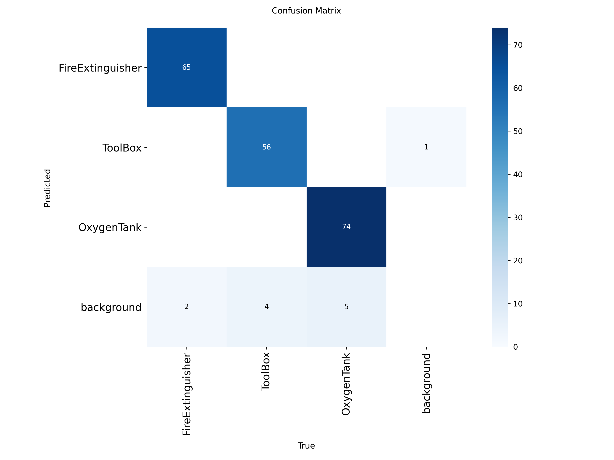

# Real-Time Safety Detection


*Figure: Model achieving mAP@0.5 = 0.983 (see confusion matrix and training results below)*

---

## Application Demo & Use Case (click it to see demo video , the best one is at last of video , so see it all)

[](https://youtu.be/oeHpo3rIKeA?feature=shared)

[Watch on YouTube](https://youtu.be/oeHpo3rIKeA?feature=shared) 

[](https://www.youtube.com/watch?v=zKmHSGjJm9I&ab_channel=Stark)
[Watch on YouTube application demo(both are clickable images](h[ttps://youtu.be/oeHpo3rIKeA?feature=shared](https://www.youtube.com/watch?v=zKmHSGjJm9I&ab_channel=Stark)) 

## Table of Contents

- [Project Overview](#project-overview)
- [Features](#features)
- [Directory Structure](#directory-structure)
- [Setup & Installation](#setup--installation)
- [Dataset](#dataset)
- [Model Training](#model-training)
- [Applications](#applications)
  - [1. RealTime_Detection](#1-realtimedetection)
  - [2. safety-detection-app](#2-safety-detection-app)
- [Evaluation & Results](#evaluation--results)
- [Sample Predictions](#sample-predictions)
- [Updating the Model](#updating-the-model)
- [Contributing](#contributing)
  

---

## Project Overview

Duality AI is a real-time safety detection system leveraging YOLOv8 for high-accuracy object detection in safety-critical environments. It features both a Python-based real-time detection script and a full-stack web application for image-based detection and result visualization.

---

## Features

- **YOLOv8l Model**: Single, high-accuracy model for all safety classes.
- **Real-Time Detection**: Python script for live camera or video stream analysis.
- **Web Application**: Upload images, view detection results, and track history.
- **Modern UI**: Futuristic, black-and-white themed React frontend.
- **Performance**: Achieves mAP@0.5 = 0.983 (see proof above).
- **Extensible**: Easy to update model and dataset as new safety requirements emerge.

---

## Directory Structure

```
Duality_ai/
│
├── Real-time-live-detection/
│   └── realtime_detection.py
│
├── safety-detection-app/
│   ├── backend/
│   │   └── main.py
│   └── frontend/
│       └── src/
│           ├── pages/
│           │   ├── Home.jsx
│           │   ├── Detect.jsx
│           │   ├── History.jsx
│           │   └── ModelFeedback.jsx
│           └── App.jsx
│
├── runs/
│   └── detect/
│       └── train5/
│           ├── weights/
│           │   └── best.pt
│           ├── confusion_matrix.png
│           ├── results.png
│           └── ...
│
├── data/
│   ├── train/
│   ├── val/
│   ├── test/
│   
│
├── predictions/
│   └── images/
│
├── Screenshot 2025-07-15 221436.png
├── train.py
├── predict.py
├── resume_train.py
├── visualize.py
├── classes.txt
├── yolo_params.yaml
└── yolov8l.pt
```

---

## Setup & Installation

### 1. Environment Setup

- Use the scripts in `ENV_SETUP/` for Windows:
  - `create_env.bat` – Create a virtual environment
  - `install_packages.bat` – Install required Python packages
  - `setup_env.bat` – Set environment variables

### 2. Backend

```bash
cd safety-detection-app/backend
pip install -r requirements.txt
uvicorn main:app --reload
```

### 3. Frontend

```bash
cd safety-detection-app/frontend
npm install
npm run dev
```

### 4. Real-Time Detection

```bash
cd RealTime_Detection
python realtime_detection.py
```

---

## Dataset

- **Location:** `data/`
- **Structure:** Follows YOLO format with `images/` and `labels/` for `train`, `val`, `test`
- **Classes:** See `classes.txt` for class names.

---

## Model Training

- **Script:** `train.py`
- **Model:** YOLOv8l (`yolov8l.pt` as base, fine-tuned)
- **Parameters:** See `yolo_params.yaml`
- **Weights:** Best model at `runs/detect/train5/weights/best.pt`

---

## Applications

### 1. Real-Time Live Detection

- **Script:** `Real-time-live-detection/realtime_detection.py`
- **Function:** Advanced real-time detection on webcam, video, or IP camera streams using YOLOv8.
- **Features:**
  - GPU/CPU support with auto-detection
  - Adjustable confidence/IoU thresholds
  - Save annotated video output (optional)
  - Color-coded bounding boxes by confidence
  - FPS and device info overlay
  - Supports DroidCam/IP camera streams
- **Usage:**
  ```bash
  python realtime_detection.py --source 0
  # For IP camera: python realtime_detection.py --source http://192.168.1.2:4747/video
  # To save output: python realtime_detection.py --output output.mp4
  # For CPU: python realtime_detection.py --device cpu
  # Adjust confidence: python realtime_detection.py --conf 0.6
  ```
- **Options:**
  - `--source`: Webcam index or video/IP stream URL (default: 0)
  - `--output`: Path to save annotated video (optional)
  - `--device`: '0' for GPU, 'cpu' for CPU (default: 0)
  - `--conf`: Confidence threshold (default: 0.5)
  - `--iou`: IoU threshold for NMS (default: 0.5)
  - `--max-det`: Maximum detections per frame (default: 300)

### 2. safety-detection-app

- **Backend:** FastAPI (`safety-detection-app/backend/main.py`)
- **Frontend:** React (`safety-detection-app/frontend/src/`)
- **Features:** Upload images, view detection results, detection history, and feedback.
- **Usage:**  
  - Start backend and frontend as described above.
  - Access the app at `http://localhost:5173` (or as configured).

---

## Evaluation & Results

- **mAP@0.5:** 0.983 (see screenshot above)
- **Confusion Matrix:**  
  
- **Other Metrics:** See `runs/detect/train5/results.png`, `F1_curve.png`, etc.

---

## Sample Predictions

- **Location:** `predictions/images/`
- **How to Generate:** Use `predict.py` or the web app to run inference on new images.

---

## Updating the Model

1. **Collect New Data:** Add new images to `data/`.
2. **Annotate:** Label new data in YOLO format.
3. **Retrain:** Run `train.py` with updated data.
4. **Update Weights:** Replace `best.pt` in both apps.
5. **Validate:** Check results and update as needed.

---

## Contributing

Pull requests and suggestions are welcome! Please open an issue for major changes.

---


---

**For any questions, contact the project maintainer.**

---

**Note:**  
- Update image links if you move or rename screenshots.
- Add more details or sections as your project evolves. 
